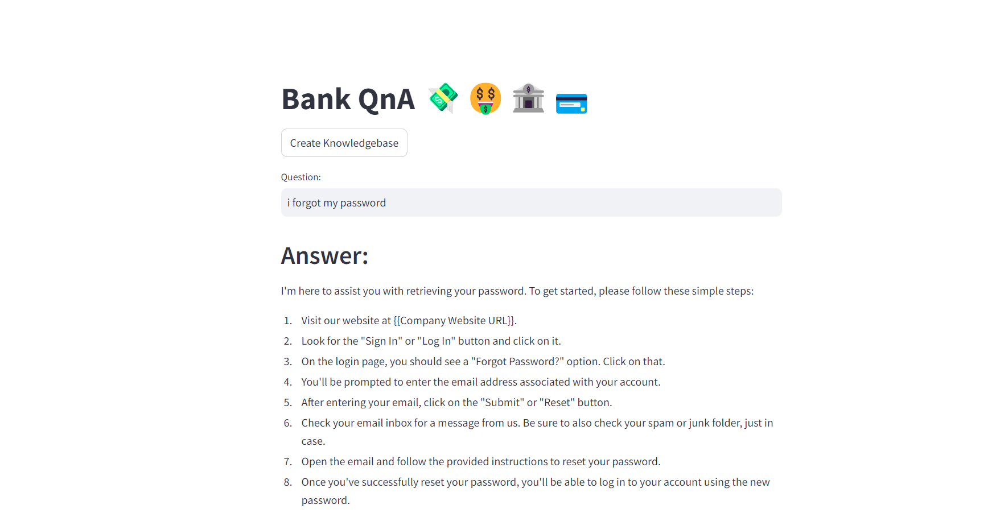

# Bank QnA: Question and Answer System Based on Google Gemini LLM and Langchain for a bank 

This is an end to end LLM project based on Google Gemini and Langchain. We are building a Q&A system for a bank. The bank provides various services such as checking accounts, loan services, mortgage services, online banking services and ATM card services. They have thousands of customers who use phone or email to ask questions. This system will provide a streamlit based user interface for customers where they can ask questions and get answers. 



## Project Highlights

- Use an excel file with commonly asked questions. 
- We will build an LLM based question and answer system that can reduce the workload of their human staff.
- Customers should be able to use this system to ask questions directly and get answers within seconds

## Technologies used
  - Langchain + Google Gemini LLM: LLM based Q&A
  - Streamlit: UI
  - Huggingface instructor embeddings: Text embeddings
  - FAISS: Vector databse

## Usage

1. Run the Streamlit app by executing:
```bash
streamlit run main.py

```

2.The web app will open in your browser.

- To create a knowledebase of FAQs, click on Create Knolwedge Base button. It will take some time before knowledgebase is created so please wait.

- Once knowledge base is created you will see a directory called faiss_index in your current folder

- Now you are ready to ask questions. Type your question in Question box and hit Enter

## Sample Questions
  - I forgot my password
  - My card got stuck
  - How to apply for a loan?
  - What are my loan charges?
  - I don't want to talk to you. Can I talk to an actual person?

## Project Structure

- main.py: The main Streamlit application script.
- langchain_helper.py: This has all the langchain code
- .env: Configuration file for storing your Google API key.
